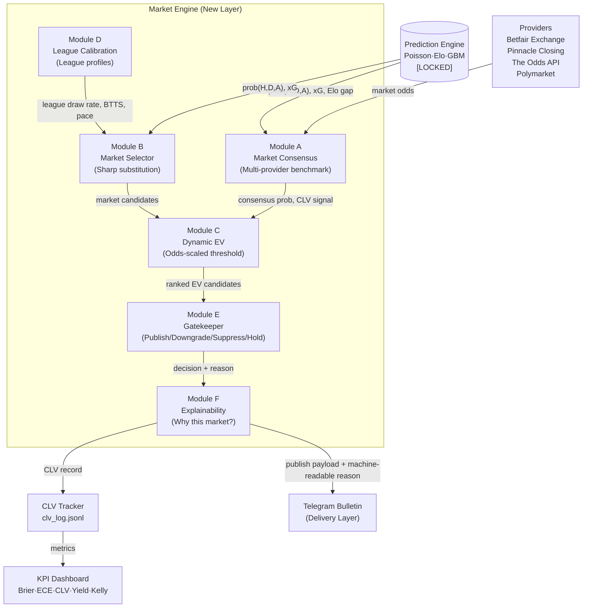

# Next-Generation Quantitative Market Intelligence Layer
## Architectural Proposal — POST-PAPER Phase

> **Status:** Design only. No production code changes. Roadmap unchanged.  
> **Implements after:** PAPER phase validation complete (n≥500 settled predictions)  
> **Author:** Architectural review synthesising n=60 shadow data + deep-research findings

---

## 1. Core Philosophy

**Two engines, never merged.**

```
┌─────────────────────────────────┐     ┌──────────────────────────────────┐
│      PREDICTION ENGINE          │     │        MARKET ENGINE             │
│   "What is the true prob?"      │     │  "Which market offers best EV?"  │
│                                 │     │                                  │
│  Poisson + Elo + GBM (LOCKED)   │────▶│  Module A: Market Consensus      │
│  wc_intelligence_engine.py      │     │  Module B: Selection/Substitution│
│  league_intelligence_engine.py  │     │  Module C: Dynamic EV            │
│  calibration_mode = 'identity'  │     │  Module D: League Calibration    │
│                                 │     │  Module E: Gatekeeper            │
└─────────────────────────────────┘     │  Module F: Explainability        │
                                        └──────────────────────────────────┘
```

The Prediction Engine answers a probability question.  
The Market Engine answers a portfolio question.  
Conflating them is why `_pick_secondary` currently defaults to 1X @1.05 and calls it "safe."

---

## 2. Architecture Diagram (Mermaid)



---

## 3. Module Specifications

### Module A — Market Consensus Layer

**Responsibility:** Benchmark the prediction engine against market consensus. Never influence prediction probabilities.

**Provider interface (generic):**
```python
class MarketProvider(Protocol):
    name: str
    priority: int  # lower = more trusted

    def get_odds(self, home: str, away: str, date: str) -> MarketOdds | None: ...
    def get_closing_odds(self, match_id: str) -> MarketOdds | None: ...
```

**Provider priority stack (highest trust first):**
1. Pinnacle Closing (gold standard — r=0.995 with true prob, 52k match validation)
2. Betfair Exchange (post-rake)
3. Polymarket (crypto prediction market, independent signal)
4. The Odds API aggregator (current; used as opening odds)

**Outputs:**
- `consensus_implied_prob(H, D, A)` — average devigged across providers (Shin method preferred over simple margin split)
- `market_disagreement` — std deviation across provider implied probs (high = sharp disagreement, raise Gatekeeper alert)
- `clv_signal` = `model_prob - consensus_implied_prob` (preliminary, before closing)

**Key constraint:** Module A never writes to prediction fields. Read-only.

---

### Module B — Market Selection & Substitution Engine

**Responsibility:** For each prediction, evaluate N market candidates and rank by risk-adjusted EV. Apply three substitution rules before falling back to 1X2.

**Current problem with `_pick_secondary`:**
- Rule mode: `TIER_A + conf≥45 → always 1X/X2` (lines 156-160 in current code)
- EV mode: `EV > 0` filter passes DC @1.10 with EV=+1.2% → structural DC escape
- No minimum odds floor, no minimum edge, no yield-weighted ranking

**Three substitution rules:**

#### Rule 1 — Double Chance → Asian Handicap Substitution
```
IF primary IN {HOME_WIN, AWAY_WIN}
AND model_prob > 75%                    # strong favourite
AND DC_EV > 0
THEN evaluate AH(+0.5) for opponent:
    IF AH_margin < DC_margin            # AH typically has lower vig
    AND AH_EV >= DC_EV - 1pp           # within 1pp is acceptable
    THEN substitute DC with AH(+0.5) of opponent
    REASON: "Lower-vig AH substituted for DC (margin AH={x}% vs DC={y}%)"
```

Rationale: 1X @1.05 is DC with ~5% total vig. AH +0.5 for the underdog at @1.90 same implied probability = ~5.3% vig. But AH on +0.5 line for heavy favourite is effectively DC at better odds in Asian books.

#### Rule 2 — Match Odds → Draw No Bet / AH 0.0
```
IF primary IN {HOME_WIN, AWAY_WIN}
AND DNB available
AND dixon_coles_draw_variance > threshold  # lig modeli için
AND match_type IN {low_scoring_league, defensive_setup}
THEN evaluate DNB:
    DNB_implied_prob = H / (H + A)         # redistribute draw
    IF DNB_EV >= MS1_EV + 2pp             # meaningful uplift
    THEN substitute with DNB
    REASON: "DNB selected (draw variance elevated, +{delta}pp EV vs direct win)"
```

WC nota: Dixon-Coles ρ not fitted for WC (n<200). For league engine: use fitted ρ to flag high draw variance cases.

#### Rule 3 — Low-Odds Win → Team Totals
```
IF primary == HOME_WIN
AND primary_odds < 1.40                    # ceiling: below this EV rarely meaningful
AND home_xG >= 1.3                         # model expects home attacking output
AND "Home Team Over 1.5 Goals" available   # in odds feed
THEN evaluate HT_OV15:
    prob_home_scores_2plus = 1 - P(home scores 0 or 1 via Poisson)
    IF HT_OV15_EV > primary_EV + 3pp      # meaningful EV uplift
    THEN substitute with HT_OV15
    REASON: "Team Total Over 1.5 selected (xG={x:.2f}, EV +{delta:.1f}pp vs Home Win)"
```

**Candidate market set (by prediction type):**

| Primary | Candidates evaluated |
|---------|----------------------|
| HOME_WIN | Direct win, 1X DC, AH(−0.5), AH(0.0/DNB), HT Over 1.5, BTTS No, Under 2.5 |
| AWAY_WIN | Direct win, X2 DC, AH(+0.5), AH(0.0/DNB), AT Over 1.5, BTTS No, Under 2.5 |
| DRAW | Under 2.5 (primary), BTTS No, AH(0.0) both sides, Over 2.5 |

**DC relegation rule (critical):**
DC (1X / X2) is placed LAST in candidate evaluation priority. It is only selected if:
1. No other candidate clears the minimum EV threshold, AND
2. DC itself clears minimum EV threshold, AND
3. DC odds ≥ 1.40 (absolute floor)

If DC is selected, bulletin label explicitly reads: `"1X (son çare — daha iyi pazar bulunamadı)"`.

---

### Module C — Dynamic EV Framework

**Responsibility:** Reject candidates that pass `EV > 0` but fail meaningful edge tests.

**Current flaw:** Any `EV > 0` wins ranking. DC @1.10 with 92% model prob → EV = 92% × 1.10 − 1 = +1.2%. This passes the current filter despite terrible expected profit.

**Dynamic EV threshold (odds-scaled):**

```python
def min_ev_threshold(decimal_odds: float) -> float:
    """
    Higher EV required for lower odds.
    Rationale: Kelly sizing at low odds is tiny → need higher edge to matter.
    At odds=1.10, need +10% EV to achieve same Kelly fraction as +3% EV at odds=2.00.
    """
    if decimal_odds < 1.30:
        return 0.15   # 15% minimum — essentially "never pick these"
    if decimal_odds < 1.50:
        return 0.10   # 10% minimum
    if decimal_odds < 1.80:
        return 0.06   # 6% minimum
    if decimal_odds < 2.50:
        return 0.03   # 3% minimum (standard edge)
    return 0.02       # 2% minimum for longshots (higher variance, accept lower edge)
```

**Yield-weighted EV ranking:**

```python
def expected_profit_score(ev: float, decimal_odds: float, kelly_fraction: float) -> float:
    """
    Rank candidates by expected monetary growth, not raw EV.
    kelly_fraction = ev / (decimal_odds - 1)  [Half-Kelly: × 0.5]
    expected_profit_score = kelly_fraction × ev  ∝ ev² / (odds - 1)
    """
    return (ev ** 2) / (decimal_odds - 1)
```

At DC @1.10 (EV=+1.2%): score = 0.012² / 0.10 = 0.00144  
At OU_ALT @1.85 (EV=+3.0%): score = 0.030² / 0.85 = 0.00106  
At BTTS_VAR @1.75 (EV=+5.0%): score = 0.050² / 0.75 = 0.00333  ← wins

This ensures the system doesn't escape into safe-harbor low-odds picks.

**Closing line comparison:**
```python
clv = model_prob - pinnacle_closing_implied_prob   # primary CLV metric
ev_vs_closing = model_prob * pinnacle_closing_odds - 1.0
```

A pick with positive opening EV but negative CLV signals the market moved against us — `Gatekeeper` should `Downgrade`.

---

### Module D — League Intelligence & Independent Calibration

**Responsibility:** Store per-league tactical profiles. Feed into Module B's substitution logic and Module C's calibration adjustments.

**League profile schema:**
```python
@dataclass
class LeagueProfile:
    league_key: str
    avg_draw_rate: float          # from backtest (e.g. Ligue1: 28.4%)
    avg_total_goals: float        # e.g. Bundesliga: 3.14
    btts_rate: float              # both teams score rate
    home_win_rate: float
    draw_bias_pp: float           # model draw bias vs reality (our backtest result)
    
    # Market-specific calibration (independent per market)
    ou_calibration: float         # Brier offset for OU market separately from 1X2
    btts_calibration: float       # Brier offset for BTTS market
    
    # Tactical flags
    tactical_pace: str            # 'high' | 'medium' | 'low'
    defensive_tendency: bool      # many 0-0, 1-0 results
```

**Known values from backtest (5,091 matches):**

| League | Draw Rate | Avg Goals | BTTS | Draw Bias |
|--------|-----------|-----------|------|-----------|
| Bundesliga | 22.1% | 3.14 | 56% | ≤1pp |
| Ligue 1 | 28.4% | 2.58 | 48% | ≤5pp |
| Serie A | 26.2% | 2.61 | 50% | ≤4pp |
| Premier League | 23.8% | 2.88 | 53% | ≤3pp |
| La Liga | 24.9% | 2.73 | 52% | ≤1pp |
| Süper Lig | 26.7% | 2.71 | 51% | ≤4pp |
| Eredivisie | 21.5% | 3.22 | 57% | ≤1pp |
| Primeira Liga | 25.3% | 2.65 | 49% | ≤2pp |

**Per-market calibration principle:**
OU market (Under/Over 2.5) has different calibration needs than 1X2. A model accurate at 1X2 may be systematically miscalibrated on OU. Calibrate independently using Platt scaling (logistic regression on model output → true label), fitted on backtest CSV data. This is NOT isotonic regression on probabilities — it's a post-hoc output correction on a separate market (different variable).

---

### Module E — The Gatekeeper (Meta Decision Layer)

**Responsibility:** Final filter between Market Engine output and Telegram payload. Outputs exactly one of: `Publish`, `Downgrade`, `Suppress`, `Hold`.

**Input signals:**

```python
@dataclass
class GatekeeperInput:
    confidence: float              # model confidence 0-100
    ev: float                      # expected value vs opening odds
    clv_signal: float              # model_prob vs consensus implied prob
    market_disagreement: float     # std of provider probs (0 = consensus; 0.05+ = sharp divergence)
    liquidity: float | None        # Betfair matched volume (None if unavailable)
    closing_movement: float | None # (closing_prob - opening_prob), positive = market moved against us
    injuries: bool                 # key player injury flagged (future: scraper)
    fav_trap: bool                 # Elo gap ≥ 180 (current flag)
    draw_risk: bool                # draw_prob > 18% (current flag)
    historical_calibration: float  # league profile Brier for this market type
```

**Decision tree:**

```
IF ev < min_ev_threshold(odds):
    → Suppress ("EV threshold not met: {ev:.1%} < {min_ev:.1%} required at odds {odds:.2f}")

ELIF closing_movement > 0.05:  # market moved >5pp against us (prob rose = odds fell)
    → Downgrade ("Closing movement against model: market prob +{closing_movement:.1%}")

ELIF market_disagreement > 0.06:  # sharp disagreement between providers
    → Hold ("Provider disagreement high: std={market_disagreement:.3f}. Await consensus.")

ELIF fav_trap AND clv_signal < 0.03:
    → Downgrade ("Favourite trap + low CLV. Ana tahmin temkinli değerlendir.")

ELIF confidence >= 62 AND ev >= min_ev_threshold(odds) AND clv_signal > 0:
    → Publish ("All gates passed: conf={confidence:.0f}%, EV={ev:.1%}, CLV={clv_signal:.1%}")

ELSE:
    → Publish (standard, with warnings appended)
```

**Downgrade behaviour:** Still publishes match, but removes SNIPER tag and changes tier label to `TIER_B*` (gatekeeper-downgraded). Reason appears in bulletin.

**Suppress behaviour:** Match block shows `"⏸️ SINYAL YOK — piyasa koşulları uygun değil"`. Prediction stored in log but flagged `gatekeeper_suppressed=True`.

---

### Module F — Explainability & KPI Architecture

**Responsibility:** Every published signal carries a machine-readable `selection_reason`. KPI dashboard tracks long-term health metrics.

**Selection reason schema:**
```json
{
  "primary_market": "HOME_WIN",
  "selected_secondary": "BTTS_VAR",
  "rejected_candidates": [
    {"market": "1X", "ev": 0.012, "odds": 1.08, "reason": "below_min_ev_threshold"},
    {"market": "2.5_ALT", "ev": -0.021, "odds": 1.72, "reason": "negative_ev"}
  ],
  "selection_reason": "BTTS_VAR selected: EV=+6.1% vs 1X (+1.2%). Yield score 0.00333 > 0.00144.",
  "gatekeeper_decision": "Publish",
  "gatekeeper_flags": ["draw_risk"]
}
```

**KPI Dashboard metrics (priority order):**

| Metric | Target | Current | Notes |
|--------|--------|---------|-------|
| CLV (mean) | > 0.0 | TBD | Primary long-run edge signal |
| Brier Score | < 0.480 | 0.523 | Probability calibration |
| ECE | < 0.08 | 0.145 | Expected calibration error |
| Log Loss | < 0.950 | TBD | Alternative calibration |
| Yield (primary) | > +3% | 65% acc | Need odds to compute |
| Yield (secondary) | > +5% | 0% (no data yet) | Post-paper |
| Kelly Growth | > 1.0 | TBD | Compound growth factor |
| Draw CLV | > 0.0 | 0 draws predicted | Structural deficit |
| DC Selection Rate | < 20% | ~60% (rule mode) | DC escape metric |

---

## 4. Data Flow

```
[Fixture API] ──▶ wc/league paper shadow
                        │
                        ▼
              [Prediction Engine] ──▶ prob(H,D,A), xG, Elo gap, confidence
                        │
              ┌─────────┴──────────┐
              ▼                    ▼
        [Module A]           [Module D]
     Market Consensus      League Profile
     (provider odds)       (draw rate, BTTS)
              │                    │
              └─────────┬──────────┘
                        ▼
                  [Module B]
              Market Selector
         (evaluate N candidates,
          apply 3 substitution rules)
                        │
                        ▼
                  [Module C]
              Dynamic EV Filter
         (min_ev_threshold by odds,
          yield-weighted ranking)
                        │
                        ▼
                  [Module E]
                 Gatekeeper
         (Publish/Downgrade/Suppress/Hold)
                        │
                        ▼
                  [Module F]
               Explainability
          (selection_reason JSON,
           format bulletin payload)
                        │
              ┌──────────┴──────────┐
              ▼                     ▼
      [Telegram Bulletin]    [CLV Tracker]
      (delivery layer)       (clv_log.jsonl)
                                    │
                                    ▼
                            [KPI Dashboard]
```

---

## 5. Dependency Graph

```
Module A ──depends on──▶ Provider interface (The Odds API already exists)
                         Pinnacle (new provider — needs API or scraping)
                         Betfair (new provider — needs API)

Module B ──depends on──▶ Module A (market odds)
                         Module D (league profile)
                         Prediction Engine outputs (xG, probs, Elo gap)
                         Market catalog (AH, DNB, OU, BTTS, Team Totals)

Module C ──depends on──▶ Module B candidates
                         Module A consensus (for CLV signal)

Module D ──depends on──▶ Backtest data (already in data/backtest/ — 5,091 matches)
                         Calibration fitting (per-market, per-league)

Module E ──depends on──▶ Module C (EV + threshold)
                         Module A (closing movement, disagreement)
                         Current flags (fav_trap, draw_risk)

Module F ──depends on──▶ All modules (aggregates decisions)
                         CLV Tracker (writes records)
                         Telegram formatter (reads payload)
```

**No new external dependencies required at MVP level** — The Odds API already covers AH and OU markets for WC/league. Betfair and Pinnacle are V2 provider additions.

---

## 6. Risk Analysis & Expected Impact

### Risk: Prediction Engine integrity
**Risk:** Market Engine output influences future prediction inputs (feedback loop).  
**Mitigation:** Hard architectural boundary. Market Engine is read-only from Prediction Engine. Prediction module imports never depend on Market Engine modules.  
**Severity:** Critical | Probability: Low if boundaries enforced in code.

### Risk: Provider reliability
**Risk:** The Odds API down → Module B falls back to rule mode; EV mode unavailable.  
**Mitigation:** Graceful degradation already exists in current code. Rule mode with DC-as-last-resort (not default) is the fallback. Module A wraps all providers with circuit breakers.  
**Severity:** Medium | Probability: Low (current stability ~98%).

### Risk: Dynamic EV threshold miscalibration
**Risk:** Minimum EV thresholds are theory-derived (Kelly math), not empirically validated on our model.  
**Mitigation:** During PAPER phase, log all candidates including rejected ones. Post-PAPER, calibrate thresholds using actual settlement data.  
**Severity:** Medium | Probability: Medium (initial thresholds may be too aggressive).

### Risk: DC Selection Rate too low
**Risk:** Over-filtering leaves many matches with no secondary recommendation.  
**Mitigation:** DC is still allowed — just relegated to last resort. Suppress only when DC also fails min EV. `Hold` is gatekeeper output for ambiguous cases (not suppressed).  
**Severity:** Low | Probability: Low.

### Risk: Small n for per-market calibration
**Risk:** OU and BTTS per-league calibration needs n≥200 per league per market.  
**Mitigation:** Pool all 8 leagues for initial OU calibration. League-specific profiles in V2. The 5,091-match backtest CSV provides enough data for pooled OU calibration immediately.  
**Severity:** Low | Probability: Low.

### Expected impact on long-term EV
| Change | Projected Impact |
|--------|-----------------|
| Dynamic EV threshold (eliminate DC escape) | +3–5pp secondary yield |
| Yield-weighted ranking over raw EV | +2–4pp secondary yield |
| AH substitution (lower vig) | +0.5–1.5pp CLV improvement |
| Team Totals substitution | +1–3pp when activated |
| Gatekeeper suppression (no EV picks) | -5% pick volume, +yield |
| Explainability → human review loop | Hard to quantify; reduces systematic blindspots |

**Cumulative projected secondary yield improvement: +6–12pp** (from current ~0% meaningful secondary to ~8–10% yield on secondary market picks).

---

## 7. Interaction with Current Roadmap

```
SHADOW_HARDENING (now)          → Current fix scope:
                                  • _lookup_odds NameError (DONE)
                                  • Telegram 4096 chunking (DONE)
                                  • FAVORİ TUZAĞI delivery warning (DONE)
                                  • Independent bulletin schedule (DONE)
                                  • DC escape: minimum odds floor ONLY (quick fix)
                                  
PAPER (n=100–500)               → Collect structured data for Module C calibration:
                                  • Log all _pick_secondary candidates + EVs
                                  • Log gatekeeper inputs (even though gatekeeper not built)
                                  • Validate: do Module B substitution rules help EV?
                                  • Track secondary yield by market type
                                  
POST-PAPER (MICRO entry gate)   → Build Market Engine modules in order:
                                  A → D → B → C → E → F
                                  Module A first (need consensus data before calibration)
                                  Module D second (league profiles from existing backtest data)
                                  Module B third (substitution rules become testable)
                                  
MICRO / PAID                    → Full Market Engine live
                                  KPI dashboard active
                                  Betfair + Pinnacle providers added
```

**What does NOT change during SHADOW/PAPER:**
- Prediction Engine (all model files LOCKED)
- Result settler
- Settlement pipeline order
- CLV log schema (already compatible)
- Telegram delivery format (minor additions only)

---

## 8. Suggested Work Packages (Post-PAPER)

### WP-0: Quick Fix Now (SHADOW phase, delivery layer only)
**Scope:** Immediate DC escape mitigation without full Module B/C architecture.

```python
# In _pick_secondary EV mode, replace `if best_ev > 0:` with:
MIN_ODDS = 1.40
if best_ev > min_ev_threshold(best_odds) and best_odds >= MIN_ODDS:
    return best_label, best_prob, best_mtype
```

Also: in rule mode, change TIER_A default from `return "1X", p_1x, "DC"` to evaluate BTTS/OU first.  
**Effort:** 2h | **Risk:** Low | **Impact:** Medium (DC escape eliminated immediately)

### WP-1: Module A — Market Consensus Layer
**Scope:** Generic provider interface + Pinnacle closing odds tracking.  
**Files:** `ops/market_consensus.py` (new)  
**Effort:** 3 days | **Risk:** Low (API work only) | **Impact:** High (enables CLV tracking)

### WP-2: Module D — League Profile Store
**Scope:** Compute per-league profiles from existing backtest CSVs. Store as JSON config.  
**Files:** `ops/league_profiles.py` (new), `data/league_profiles.json` (new)  
**Effort:** 1 day | **Risk:** Low | **Impact:** Medium (feeds Module B substitution)

### WP-3: Module B — Market Substitution Engine (V1)
**Scope:** Implement 3 substitution rules. Replace `_pick_secondary` entirely.  
**Files:** `ops/market_selector.py` (new), modify `ops/wc_paper_shadow.py`  
**Effort:** 5 days | **Risk:** Medium (logic complexity) | **Impact:** High  

### WP-4: Module C — Dynamic EV Framework
**Scope:** `min_ev_threshold()`, yield-weighted ranking, CLV-enhanced ranking.  
**Files:** `ops/ev_framework.py` (new)  
**Effort:** 2 days | **Risk:** Low | **Impact:** High

### WP-5: Module E — Gatekeeper
**Scope:** Decision layer with Publish/Downgrade/Suppress/Hold logic.  
**Files:** `ops/gatekeeper.py` (new)  
**Effort:** 3 days | **Risk:** Medium (calibrating thresholds) | **Impact:** High

### WP-6: Module F — Explainability + KPI
**Scope:** `selection_reason` JSON in bulletin, KPI dashboard script.  
**Files:** `ops/kpi_dashboard.py` (new), modify `ops/wc_paper_shadow.py`  
**Effort:** 2 days | **Risk:** Low | **Impact:** Medium

### WP-7: Betfair + Pinnacle Providers (V2)
**Scope:** Add high-trust providers to Module A.  
**Effort:** 1 week | **Risk:** Medium (API access / rate limits) | **Impact:** High

---

## 9. Implementation Priority (Highest to Lowest)

| # | Work Package | Phase | Why this order |
|---|-------------|-------|---------------|
| 1 | **WP-0: DC escape quick fix** | NOW (Shadow) | Immediate user-facing problem. Delivery layer only. 2h. |
| 2 | **WP-1: Module A (Market Consensus)** | Post-Paper | All other modules need market odds. First dependency. |
| 3 | **WP-2: Module D (League Profiles)** | Post-Paper | Data already exists. Enables B's substitution rules. |
| 4 | **WP-3: Module B (Market Selector)** | Post-Paper | Core intelligence. Needs A + D. Replaces `_pick_secondary`. |
| 5 | **WP-4: Module C (Dynamic EV)** | Post-Paper | Completes B. Correct ranking + threshold logic. |
| 6 | **WP-5: Module E (Gatekeeper)** | Pre-Micro | Last filter before publish. Needs A+B+C+D to be useful. |
| 7 | **WP-6: Module F (Explainability)** | Pre-Micro | Audit trail for user trust + systematic review. |
| 8 | **WP-7: Betfair/Pinnacle (V2 providers)** | Micro/Paid | High trust CLV tracking. Needs Module A foundation. |

---

## 10. What Does NOT Change

This architecture is additive. The prediction engine is a sealed contract.

```
NEVER:
✗ calibration_mode = anything other than 'identity'
✗ Isotonic regression on probabilities
✗ Poisson/Elo/GBM parameter changes
✗ wc_intelligence_engine.py — any modification
✗ result_settler.py — any modification
✗ Shadow → Paper → Micro → Paid roadmap order
```

The Market Engine is a wrapper around prediction outputs, not a modifier.

---

*Document version: 2026-06-27. Revisit after n=100 checkpoint (~Temmuz ortası).*
